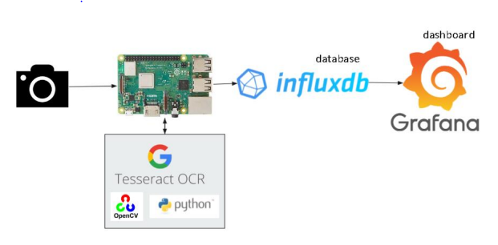

# Team Members: 

* M1 . Fauzan Mala Ekaputra A18KE0312   
* M2 . Raja Falih Ghufran A18KE0324  
* M3 . Mohammad Haizal Khan A17KE0317  

# Project Proposal

## Problem statement

In a traditional meter reading system, energy meters only measure total consumption without information on when the energy is consumed. This increases the difficulty for consumers to estimate the bill at the end of the month. For countries that charge different prices for consumption based on time of day and the season, being able to visualize the consumption of energy in real-time can help to reduce the energy bill for the customers. Reference shows that provided with real-time feedback, homeowners' electricity consumption is reduced by approximately 3-5% on average. Although 3-5% sounds small, the relatively small percentage benefits in terms of savings are multiplied by millions of users, which eventually can cause a huge difference. Other than that, the traditional meter reading process heavily relies on human labor. For instance, the laborious task to send bills to customers needs to be done manually in the traditional meter reading system. If the customers are not in the house, the reading cannot be taken. Due to the manual reading, the meter reading is error-prone and time-consuming

From the following case here are several problems to be solved :

*  The measuring energy utilization at household is not able to accurately realize the consumer energy utilization. 
*  Traditional meter reading system relies on human resources, lower efficiency, and accuracy.
*  The procedures of sending the bills to the customer are very laborious and cumbersome. The readings cannot be taken if no one is available at the home.
*  Traditional meter reading system does not provide any scope for the user to conserve energy and does it provide energy consumption predictions for the near future that enables the user to act in a more planned way.

## Purposed topic :
to design and develop an *IoT-based monitoring system for electricity consumption recording purposes*.

## System architechture

## Sensor

we will be using rasperberry pi 

here are the sample video of the group member accesing the raspberry pi via VNC viewer

https://user-images.githubusercontent.com/75777945/146175242-39d33112-e8b4-4d0f-9083-a4352e5d928c.mp4

## Cloud

For the cloud system we decided to use *pythonAnywhere* 

the following video shows our member setting up the system 

https://user-images.githubusercontent.com/75777945/146185044-b95c1844-e08c-448f-b2bb-68d58993d117.mp4

## Dashboard

InfluxDB is an open-source schemaless time-series database with optional 
closed-source components developed by InfluxData, written in Go programming 
language and optimized to handle time-series data. One of the most convenient 
feature of InfluxDB is it comes with Grafana support. Grafana is an open-source 
visualization and analytics software that allows query and visualization of the data. 
Beautiful representation of data can be formed in Grafana in various graphs and 
visualizations.

The following figure is the sample of the dashboard that is created via grafana

